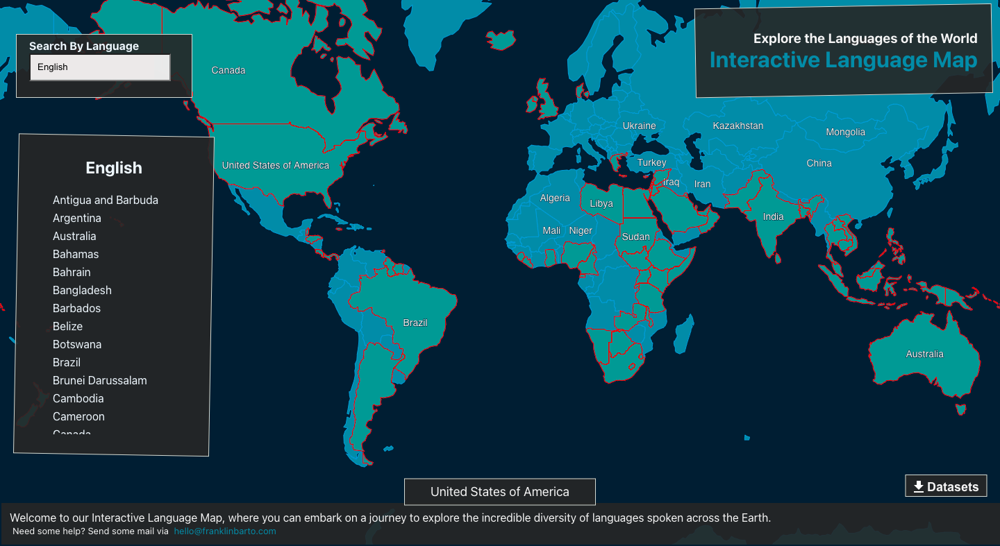

# World-Language-Map
This is application allows its users access to an interactive map to browse the different countries and view the languages spoken.

It is surprising how there isn't a single source on the internet that has an exhaustive list of language and dialects spoken in countries or regions.

The datasets used were sourced from [datahub.io](https://datahub.io/core/geo-countries), [Austrailian Government, Department of Social Services](https://www.dss.gov.au/sites/default/files/files/foi_disclosure_log/12-12-13/language-list.pdf) and Wikipedia

**Note: The data needs some work! Some of these datasets have missing or inaccurate data**

The libraries used to develop this app are React and OpenLayers

**Feel free to use this code, however kindly share and give reasonable attribution of my work.**
